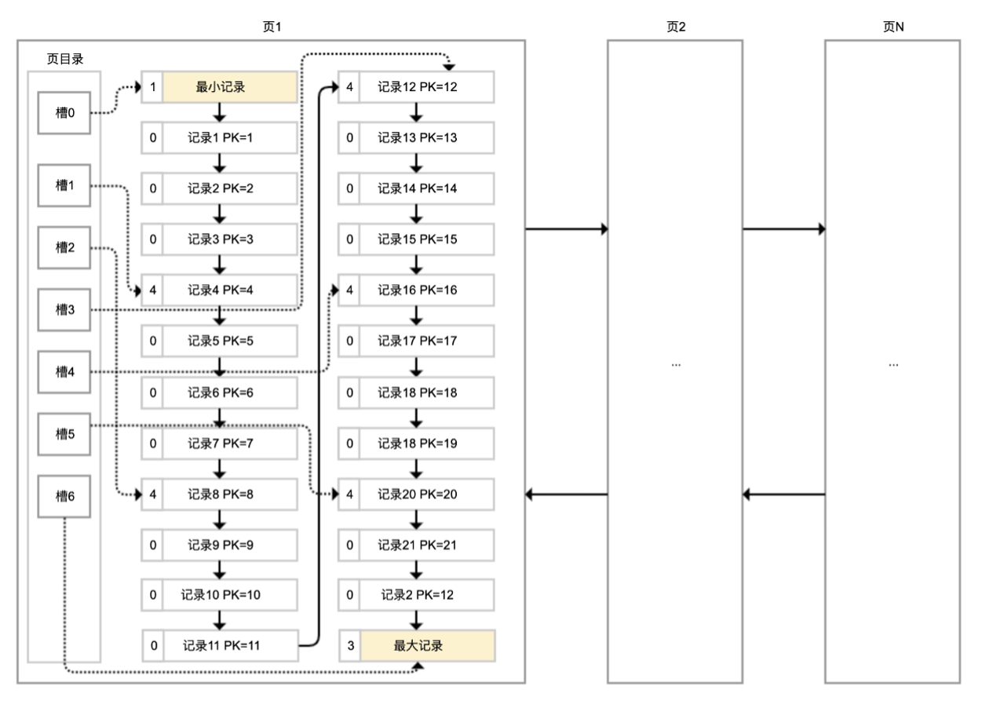

# MySql是如何存储数据的

虽然数据保存在磁盘中，但其处理是在内存中进行的。
为了减少磁盘随机读取次数，InnoDB 采用页而不是行的粒度来保存数据，即数据被分成若干页，以页为单位保存在磁盘中。
InnoDB 的页大小，一般是 16KB。

页目录通过槽把记录分成不同的小组，每个小组有若干条记录。
如图所示，记录中最前面的小方块中的数字，代表的是当前分组的记录条数，最小和最大的槽指向 2 个特殊的伪记录。
有了槽之后，我们按照主键搜索页中记录时，就可以采用二分法快速搜索，无需从最小记录开始遍历整个页中的记录链表。

举一个例子，如果要搜索主键（PK）=15 的记录：
- 先二分得出槽中间位是 (0+6)/2=3，看到其指向的记录是 12＜15，所以需要从 #3 槽后继续搜索记录；
- 再使用二分搜索出 #3 槽和 #6 槽的中间位是 (3+6)/2=4.5 取整 4，#4 槽对应的记录是 16＞15，所以记录一定在 #4 槽中；
- 再从 #3 槽指向的 12 号记录开始向下搜索 3 次，定位到 15 号记录。
