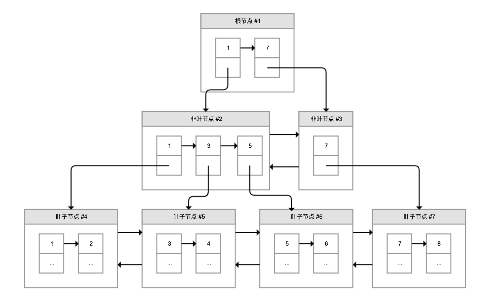

# MySql索引的B+树

1.	最底层的节点叫作叶子节点，用来存放数据；
2.	其他上层节点叫作非叶子节点，仅用来存放目录项，作为索引；
3.	非叶子节点分为不同层次，通过分层来降低每一层的搜索量；
4.	所有节点按照索引键大小排序，构成一个双向链表，加速范围查找。

因此，InnoDB 使用 B+ 树，既可以保存实际数据，也可以加速数据搜索，这就是聚簇索引。
如果把上图叶子节点下面方块中的省略号看作实际数据的话，那么它就是聚簇索引的示意图。
由于数据在物理上只会保存一份，所以包含实际数据的聚簇索引只能有一个。

我们再看看 B+ 树如何实现快速查找主键。比如，我们要搜索 PK=4 的数据，通过根节点中的索引可以知道数据在第一个记录指向的 2 号页中，通过 2 号页的索引又可以知道数据在 5 号页，5 号页就是实际的数据页，然后再通过二分法查找页目录马上可以找到记录的指针。

过早的优化，是万恶之源。不需要提前考虑建立索引。等性能出现问题，真正的需求降临的时候再考虑优化。
建立索引之前，需要考虑索引带来的副作用：维护成本，空间成本，回表成本。

更重要的是还要考虑，你的查询是否能用到索引。如果花费大量成本建立的索引，最后还用不上。那就赔了夫人又折兵了。

索引又牵扯到了很多注意事项，例如：尽量使用前缀匹配，而避免使用后缀匹配。因为后缀匹配会使得索引失效，走全表匹配。
