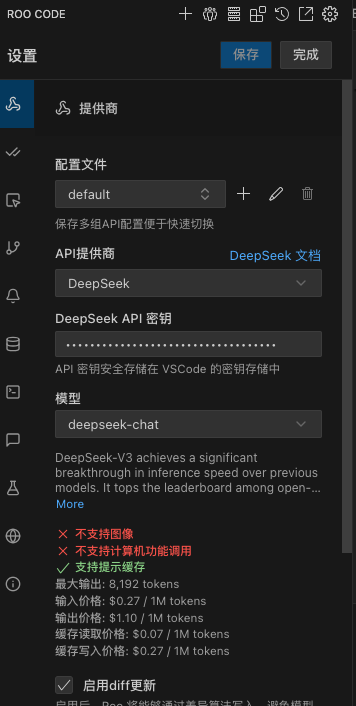
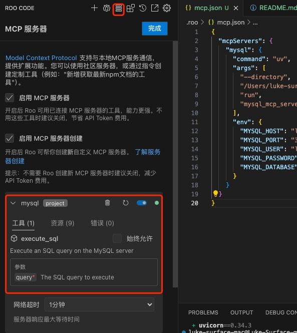
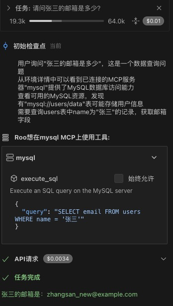
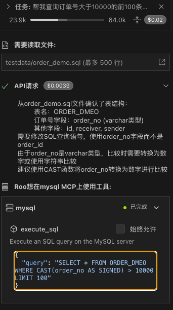

# 使用MySQL MCP Server

## 安装依赖
```shell
uv pip install -e .
```
其实什么都没有做，就是用uv初始化了一个python工程,然后添加了 MySQL MCP Server的依赖包。

---

## 在vscode RooCode 插件配置
这里的MCP host使用了 RooCode, 直接在vscode插件市场即可安装, 不需要魔法上网即可使用



这里我使用了deepseek, 你需要先申请一个deepseek的api key.


然后配置
```json
{
  "mcpServers": {
    "mysql": {
      "command": "uv",
      "args": [
        "--directory",
        "/Users/luke-surface-mac/code/mysqlnotes/mysql-mcp-server-demo",
        "run",
        "mysql_mcp_server"
      ],
      "env": {
        "MYSQL_HOST": "localhost",
        "MYSQL_PORT": "<your_mysql_port>",
        "MYSQL_USER": "<your_mysql_username>",
        "MYSQL_PASSWORD": "<your_mysql_password>",
        "MYSQL_DATABASE": "<your_mysql_database_name>"
      }
    }
  }
}
```


---

## 效果
### 实验1



我的数据：
```
MySQL [test]> select * from users;
+----+-----------+--------------------------+
| id | name      | email                    |
+----+-----------+--------------------------+
|  1 | 张三      | zhangsan_new@example.com |
|  4 | 赵六      | zhaoliu_new@example.com  |
|  6 | 王麻子    | NULL                     |
+----+-----------+--------------------------+
3 rows in set (0.005 sec)
```

---

### 实验2



可以看到，AI很厉害，我没有告诉它表名，依然查询出来了结果。

---

## references
- MySQL MCP Server: https://github.com/designcomputer/mysql_mcp_server
- uv的使用：https://github.com/worldluoji/PythonPursuit/blob/main/installation/uv/uv.md
- RooCode: https://docs.roocode.com/features/mcp/using-mcp-in-roo?utm_source=extension&utm_medium=ide&utm_campaign=mcp_server_creation#how-to-use-roo-to-create-an-mcp-server