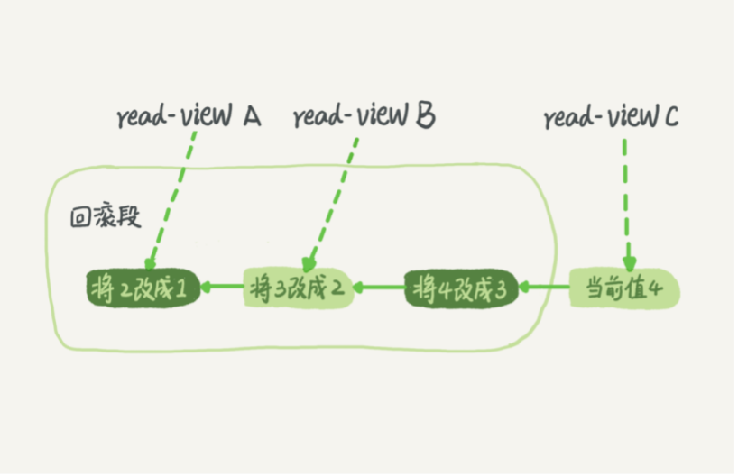

# MVVC
在 MySQL 中，实际上每条记录在更新的时候都会同时记录一条回滚操作。
记录上的最新值，通过回滚操作，都可以得到前一个状态的值。假设隔离级别是可重复读，一个值从 1 被按顺序改成了 2、3、4，在回滚日志里面就会有类似下面的记录：
 

当前值是 4，但是在查询这条记录的时候，不同时刻启动的事务会有不同的 read-view。如图中看到的，在视图 A、B、C 里面，这一个记录的值分别是 1、2、4，同一条记录在系统中可以存在多个版本，就是数据库的多版本并发控制（MVCC）。
对于 read-view A，要得到 1，就必须将当前值依次执行图中所有的回滚操作得到。

同时你会发现，即使现在有另外一个事务正在将 4 改成 5，这个事务跟 read-view A、B、C 对应的事务是不会冲突的。

回滚日志什么时候删除呢？答案是，在不需要的时候才删除。也就是说，系统会判断，当没有事务再需要用到这些回滚日志时，回滚日志会被删除。
什么时候才不需要了呢？就是当系统里没有比这个回滚日志更早的 read-view 的时候。
当没有比回滚日志更早的读视图（读视图在事务开启时创建）的时候，这个数据不会再有谁驱使它回滚了，这个回滚日志也就失去了用武之地，可以删除了。

 

## 为什么不要使用长事务？
长事务意味着系统里面会存在很老的事务视图。
由于这些事务随时可能访问数据库里面的任何数据，所以这个事务提交之前，数据库里面它可能用到的回滚记录都必须保留，这就会导致大量占用存储空间。
除了对回滚段的影响，长事务还占用锁资源，也可能拖垮整个库。

在开发过程中，尽可能的减小事务范围，少用长事务，如果无法避免，保证逻辑日志空间足够用，并且支持动态日志空间增长。
监控Innodb_trx表，发现长事务报警。
