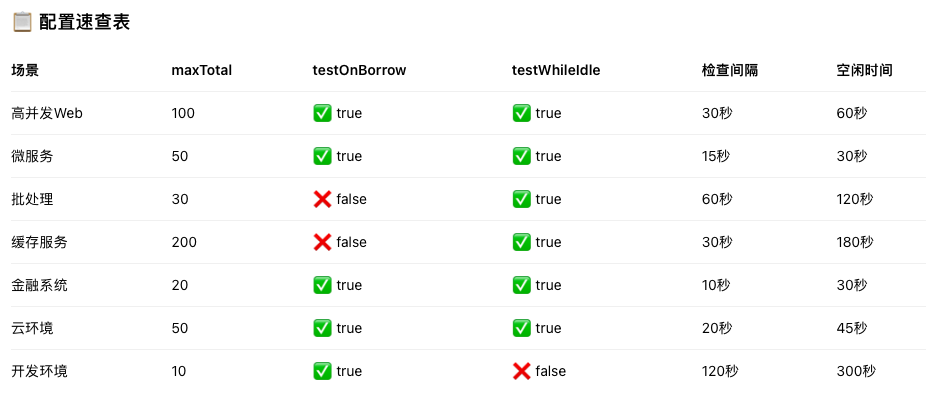

# Redis连接池通用配置与优化指南

## 📊 核心参数详解表

### 连接池基础配置
| 参数类别 | 参数名 | 默认值 | 说明 | 推荐值 | 性能影响 |
|---------|--------|--------|------|--------|----------|
| **容量控制** | max_connections | 50 | 最大连接数 | 50-500 | ⭐⭐⭐ |
| | max_idle | 10 | 最大空闲连接数 | 20-200 | ⭐⭐ |
| | min_idle | 1 | 最小空闲连接数 | 5-50 | ⭐⭐ |
| | max_wait_ms | -1 | 获取连接最大等待时间 | 2000-10000 | ⭐⭐⭐ |
| **连接验证** | test_on_borrow | false | 借出时测试连接 | true | ⭐⭐⭐⭐⭐ |
| | test_on_return | false | 归还时测试连接 | false | ⭐ |
| | test_while_idle | false | 空闲时测试连接 | true | ⭐⭐⭐ |
| **连接回收** | time_between_eviction_runs_ms | -1 | 每隔多少s秒运行一次检查 | 10000-60000 | ⭐⭐ |
| | min_evictable_idle_time_ms | 1800000 | 空闲多少秒才可被回收 | 30000-180000 | ⭐⭐ |
| | num_tests_per_eviction_run | 3 | 每次检查的连接数 | -1（全部） | ⭐⭐ |
| **网络参数** | connect_timeout | 2000 | 连接超时时间(ms) | 2000-10000 | ⭐⭐⭐ |
| | socket_timeout | 2000 | Socket读写超时 | 2000-10000 | ⭐⭐⭐ |
| | keepalive | false | 启用TCP KeepAlive | true | ⭐ |



## 🎯 语言客户端配置示例

### Python (redis-py) 最佳实践
```python
import redis
from redis.connection import ConnectionPool
import time
import random
from functools import wraps

class RedisPoolManager:
    def __init__(self, config):
        self.pool = ConnectionPool(
            host=config.get('host', 'localhost'),
            port=config.get('port', 6379),
            db=config.get('db', 0),
            password=config.get('password'),
            
            # 连接池容量配置
            max_connections=config.get('max_connections', 50),
            
            # 网络配置
            socket_keepalive=True,
            socket_keepalive_options={
                'TCP_KEEPIDLE': 60,      # 60秒后开始探测
                'TCP_KEEPINTVL': 10,     # 每10秒探测一次
                'TCP_KEEPCNT': 3         # 最多探测3次
            },
            socket_connect_timeout=config.get('connect_timeout', 5),
            socket_timeout=config.get('socket_timeout', 10),
            
            # 重连配置
            retry_on_timeout=True,
            health_check_interval=30,
            
            # SSL配置（如需要）
            ssl=config.get('ssl', False),
            ssl_certfile=config.get('ssl_certfile'),
            ssl_keyfile=config.get('ssl_keyfile'),
            ssl_ca_certs=config.get('ssl_ca_certs'),
            ssl_cert_reqs=config.get('ssl_cert_reqs', 'required'),
        )
        
        self.client = redis.Redis(connection_pool=self.pool)
        self.health_check_enabled = True
        self._start_health_monitor()
    
    def _start_health_monitor(self):
        """启动健康检查线程"""
        import threading
        
        def monitor():
            while self.health_check_enabled:
                try:
                    if not self.client.ping():
                        print("Redis健康检查失败")
                    time.sleep(30)
                except Exception as e:
                    print(f"健康检查异常: {e}")
                    time.sleep(5)
        
        thread = threading.Thread(target=monitor, daemon=True)
        thread.start()
    
    def execute_with_retry(self, func, max_retries=3):
        """带重试的执行"""
        for attempt in range(max_retries):
            try:
                return func(self.client)
            except (redis.ConnectionError, redis.TimeoutError) as e:
                if attempt == max_retries - 1:
                    raise
                
                # 指数退避 + 随机抖动
                delay = min(2 ** attempt * 100, 2000)  # 指数退避
                jitter = random.uniform(0, delay * 0.1)  # 10%随机抖动
                time.sleep(delay + jitter)
        
        return None
    
    def get_pool_status(self):
        """获取连接池状态"""
        # redis-py不直接提供状态信息，这里模拟
        return {
            "max_connections": self.pool.max_connections,
            # 实际项目中可以通过监控获取更多信息
        }
```

### Node.js (ioredis) 最佳实践
```javascript
const Redis = require('ioredis');

class RedisClient {
    constructor(config = {}) {
        this.config = {
            host: config.host || 'localhost',
            port: config.port || 6379,
            password: config.password,
            db: config.db || 0,
            
            // 连接池配置
            maxRetriesPerRequest: config.maxRetriesPerRequest || 3,
            enableReadyCheck: true,
            enableOfflineQueue: true,
            
            // 重连策略
            retryStrategy: (times) => {
                const delay = Math.min(times * 50, 2000);
                return delay;
            },
            
            reconnectOnError: (err) => {
                // 特定错误才重连
                const targetErrors = [
                    'ECONNREFUSED',
                    'ETIMEDOUT',
                    'ENOTFOUND',
                    'READONLY'
                ];
                
                if (targetErrors.some(error => err.message.includes(error))) {
                    return true;
                }
                return false;
            },
            
            // 网络配置
            connectTimeout: config.connectTimeout || 10000,
            keepAlive: 10000,
            noDelay: true,
            
            // 连接池性能
            maxLoadingRetryTime: 60000,
            enableAutoPipelining: false,
            
            // TLS/SSL
            tls: config.tls ? {
                rejectUnauthorized: false,
                ...config.tlsOptions
            } : undefined
        };
        
        this.client = new Redis(this.config);
        this.setupEventListeners();
        this.metrics = {
            reconnections: 0,
            lastReconnect: null,
            errors: []
        };
    }
    
    setupEventListeners() {
        this.client.on('connect', () => {
            console.log('Redis连接成功');
            this.metrics.lastReconnect = new Date();
        });
        
        this.client.on('error', (err) => {
            console.error('Redis错误:', err.message);
            this.metrics.errors.push({
                time: new Date(),
                error: err.message
            });
            
            // 保留最近的100个错误
            if (this.metrics.errors.length > 100) {
                this.metrics.errors.shift();
            }
        });
        
        this.client.on('reconnecting', (delay) => {
            console.log(`Redis重连中，延迟${delay}ms`);
            this.metrics.reconnections++;
        });
        
        this.client.on('close', () => {
            console.log('Redis连接关闭');
        });
        
        this.client.on('end', () => {
            console.log('Redis连接结束');
        });
    }
    
    async executeWithRetry(command, args, options = {}) {
        const maxRetries = options.maxRetries || 3;
        const timeout = options.timeout || 10000;
        
        for (let attempt = 0; attempt < maxRetries; attempt++) {
            try {
                const result = await Promise.race([
                    this.client...args,
                    new Promise((_, reject) => 
                        setTimeout(() => reject(new Error('操作超时')), timeout)
                    )
                ]);
                return result;
            } catch (error) {
                if (attempt === maxRetries - 1) {
                    throw error;
                }
                
                // 计算延迟（指数退避）
                const delay = Math.min(
                    Math.pow(2, attempt) * 100 + Math.random() * 100,
                    2000
                );
                
                await new Promise(resolve => setTimeout(resolve, delay));
            }
        }
    }
    
    async healthCheck() {
        try {
            const pong = await this.executeWithRetry('ping', [], { timeout: 5000 });
            return pong === 'PONG';
        } catch (error) {
            return false;
        }
    }
    
    getMetrics() {
        return {
            ...this.metrics,
            status: this.client.status,
            time: new Date()
        };
    }
}

// 使用示例
const redis = new RedisClient({
    host: 'localhost',
    port: 6379,
    maxRetriesPerRequest: 5,
    connectTimeout: 5000
});
```

## 🔄 重连策略模式

### 1. 指数退避 + 随机抖动（通用）
```python
def exponential_backoff(attempt, base_delay=100, max_delay=10000, jitter=True):
    """
    通用指数退避算法
    """
    delay = min(base_delay * (2 ** attempt), max_delay)
    
    if jitter:
        # 添加随机抖动（0-30%）
        jitter_amount = random.uniform(0, delay * 0.3)
        delay += jitter_amount
    
    return delay / 1000.0  # 转换为秒
```

### 2. 熔断器模式（通用伪代码）
```javascript
class CircuitBreaker {
    constructor(threshold = 5, timeout = 60000) {
        this.threshold = threshold;
        this.timeout = timeout;
        this.failureCount = 0;
        this.lastFailureTime = null;
        this.state = 'CLOSED'; // CLOSED, OPEN, HALF_OPEN
    }
    
    canExecute() {
        if (this.state === 'OPEN') {
            const now = Date.now();
            if (now - this.lastFailureTime > this.timeout) {
                this.state = 'HALF_OPEN';
                return true;
            }
            return false;
        }
        return true;
    }
    
    recordSuccess() {
        this.failureCount = 0;
        this.state = 'CLOSED';
    }
    
    recordFailure() {
        this.failureCount++;
        this.lastFailureTime = Date.now();
        
        if (this.failureCount >= this.threshold) {
            this.state = 'OPEN';
        }
    }
}
```

## 📈 性能调优公式

### 连接池大小计算公式
```
连接池大小 = (QPS × 平均响应时间) / 1000 × 峰值因子 × 安全系数

参数说明：
- QPS: 每秒查询数
- 平均响应时间: Redis命令平均响应时间(毫秒)
- 峰值因子: 通常为2-3，处理流量峰值
- 安全系数: 通常为1.2-1.5，预留缓冲
```

### Python实现
```python
def calculate_pool_size(qps, avg_response_ms, peak_factor=2, safety_factor=1.3):
    base_connections = (qps * avg_response_ms) / 1000
    return int(base_connections * peak_factor * safety_factor)
```

### Node.js实现
```javascript
function calculatePoolSize(qps, avgResponseMs, peakFactor = 2, safetyFactor = 1.3) {
    const baseConnections = (qps * avgResponseMs) / 1000;
    return Math.ceil(baseConnections * peakFactor * safetyFactor);
}
```

## 🏗️ 架构模式

### 连接池分层架构
```
应用层
    ↓
业务逻辑层
    ↓
缓存服务层（带熔断、降级）
    ↓
Redis客户端层（带重连、连接池）
    ↓
连接池管理层
    ↓
健康检查层
    ↓
Redis集群
```

### 多级缓存策略
```python
class MultiLevelCache:
    def __init__(self, redis_client, local_cache_ttl=60):
        self.redis = redis_client
        self.local_cache = {}
        self.local_cache_ttl = local_cache_ttl
        
    async def get(self, key):
        # 1. 检查本地缓存
        if key in self.local_cache:
            item = self.local_cache[key]
            if time.time() - item['timestamp'] < self.local_cache_ttl:
                return item['value']
        
        # 2. 尝试Redis
        try:
            value = await self.redis.get(key)
            if value:
                # 更新本地缓存
                self.local_cache[key] = {
                    'value': value,
                    'timestamp': time.time()
                }
            return value
        except Exception:
            # 3. 降级：返回默认值或空
            return None
```

## 📊 监控指标体系

### 关键监控指标
| 指标类别 | 指标名称 | 说明 | 告警阈值 |
|---------|----------|------|----------|
| **连接池指标** | 活跃连接数 | 正在使用的连接数 | > 80% max_connections |
| | 空闲连接数 | 空闲的连接数 | < min_idle |
| | 等待线程数 | 等待获取连接的线程数 | > 0持续10秒 |
| **性能指标** | 平均响应时间 | 命令平均耗时 | > 100ms |
| | 95分位响应时间 | 95%请求的响应时间 | > 200ms |
| | 错误率 | 失败请求比例 | > 1% |
| **重连指标** | 重连次数 | 连接重连次数 | > 5次/分钟 |
| | 重连延迟 | 重连平均延迟 | > 5秒 |

### 健康检查端点（Python Flask示例）
```python
from flask import Flask, jsonify
import time

app = Flask(__name__)

@app.route('/health')
def health_check():
    health_status = {
        'status': 'healthy',
        'timestamp': time.time(),
        'checks': []
    }
    
    try:
        # Redis健康检查
        start = time.time()
        if redis_client.ping():
            redis_latency = (time.time() - start) * 1000
            health_status['checks'].append({
                'name': 'redis',
                'status': 'healthy',
                'latency_ms': round(redis_latency, 2)
            })
        else:
            health_status['checks'].append({
                'name': 'redis',
                'status': 'unhealthy'
            })
            health_status['status'] = 'unhealthy'
    except Exception as e:
        health_status['checks'].append({
            'name': 'redis',
            'status': 'unhealthy',
            'error': str(e)
        })
        health_status['status'] = 'unhealthy'
    
    # 连接池状态检查
    pool_info = redis_client.connection_pool.get_connection_info()
    health_status['pool'] = {
        'active': pool_info.get('active', 0),
        'idle': pool_info.get('idle', 0),
        'max': pool_info.get('max', 0)
    }
    
    if health_status['pool']['active'] > health_status['pool']['max'] * 0.8:
        health_status['status'] = 'degraded'
    
    return jsonify(health_status)
```

## 🔧 配置场景速查表

| 应用场景 | 配置重点 | 连接池大小 | 验证策略 | 检查间隔 | 重试策略 |
|---------|----------|-----------|----------|----------|----------|
| **Web应用** | 响应速度 | 50-100 | test_on_borrow=true | 30秒 | 指数退避 |
| **微服务** | 资源隔离 | 20-50 | test_on_borrow=true | 15秒 | 快速重试 |
| **批处理** | 吞吐量 | 100-200 | test_while_idle=true | 60秒 | 延迟重试 |
| **缓存服务** | 低延迟 | 30-80 | test_on_borrow=true | 10秒 | 立即重试 |
| **金融系统** | 高可用 | 10-30 | 双重验证 | 5秒 | 熔断器 |
| **IoT后端** | 稳定性 | 5-20 | test_on_borrow=true | 60秒 | 随机退避 |

---

为什么test_on_borrow性能开销大，还是在很多场景建议开启？

大多数生产环境应该启用 test_on_borrow，因为：
- 连接失败的代价通常远高于性能开销
- 可避免级联故障
- 提供更稳定的用户体验

只有在以下情况下考虑禁用：
- 对延迟有极端要求（P99 < 10ms）
- 有完善的熔断、降级、重试机制
- 应用能优雅处理连接失败
- 性能是唯一关键指标

折中方案：使用 test_while_idle配合较短的检查间隔，能在保证一定可靠性的同时减少性能影响。

决策指南
```python
def decide_test_on_borrow():
    """
    决策流程图
    
    if 应用是金融/支付系统:
        return True  # 必须启用
    
    if 网络延迟 > 50ms and QPS > 1000:
        return False  # 考虑禁用
    
    if 连接失败成本 > 性能开销 * 100:
        return True  # 启用
    
    if 有完善的降级和重试机制:
        return False  # 可禁用
    
    # 默认：启用以保证可靠性
    return True
```

---

## 🚨 故障排查清单

### 连接池问题排查
```markdown
## Redis连接问题快速排查

### 1. 检查网络连通性
✅ 是否能telnet到Redis端口
✅ 防火墙规则是否允许
✅ 网络延迟是否正常

### 2. 检查Redis服务状态
✅ Redis服务是否运行
✅ 内存使用是否过高
✅ 连接数是否达到限制

### 3. 检查客户端配置
✅ 连接池大小是否合理
✅ 超时时间是否足够
✅ 是否启用连接验证

### 4. 监控指标分析
✅ 活跃连接数趋势
✅ 错误率变化
✅ 响应时间分布

### 5. 应用层检查
✅ 是否及时释放连接
✅ 重试逻辑是否正确
✅ 是否有连接泄漏
```

### Python诊断脚本
```python
import redis
import time

def diagnose_redis_connection(host='localhost', port=6379):
    """诊断Redis连接问题"""
    issues = []
    
    try:
        # 1. 测试基础连接
        start = time.time()
        client = redis.Redis(
            host=host,
            port=port,
            socket_connect_timeout=5,
            socket_timeout=5
        )
        
        ping_result = client.ping()
        latency = (time.time() - start) * 1000
        
        if ping_result:
            issues.append(f"✓ 基础连接正常，延迟: {latency:.2f}ms")
        else:
            issues.append("✗ Ping失败")
            
        # 2. 测试读写
        test_key = f"test_{int(time.time())}"
        client.set(test_key, "test_value", ex=10)
        value = client.get(test_key)
        
        if value == b"test_value":
            issues.append("✓ 读写测试正常")
        else:
            issues.append("✗ 读写测试失败")
            
        # 3. 检查配置
        config = client.config_get('maxclients')
        if config:
            issues.append(f"✓ Redis最大客户端数: {config.get('maxclients')}")
            
    except redis.ConnectionError as e:
        issues.append(f"✗ 连接错误: {e}")
    except redis.TimeoutError as e:
        issues.append(f"✗ 超时错误: {e}")
    except Exception as e:
        issues.append(f"✗ 其他错误: {e}")
    
    return issues
```

## 🎯 最佳实践总结

### 必须遵守的原则
1. **生产环境必须启用 `test_on_borrow`** - 保证连接有效性
2. **设置合理的超时时间** - 避免无限等待
3. **实现指数退避重试** - 避免重连风暴
4. **监控关键指标** - 主动发现问题
5. **使用连接池** - 避免频繁创建连接

### 配置检查清单
```yaml
required_configurations:
  connection_pool:
    - max_connections: "根据QPS计算"
    - test_on_borrow: "必须为true"
    - max_wait_ms: "设置合理超时"
    
  reconnection:
    - retry_strategy: "指数退避"
    - max_retries: "3-5次"
    - health_check: "启用健康检查"
    
  monitoring:
    - active_connections: "监控活跃连接"
    - error_rate: "监控错误率"
    - latency: "监控响应延迟"
    
  security:
    - authentication: "启用密码认证"
    - tls: "生产环境启用TLS"
    - network_policy: "限制访问IP"
```

### 性能优化步骤
1. **基准测试** - 确定当前性能基线
2. **渐进调整** - 每次只调整一个参数
3. **压力测试** - 验证配置效果
4. **监控验证** - 观察生产环境表现
5. **文档记录** - 记录最佳配置